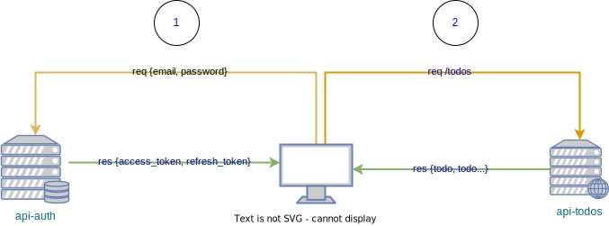

# Todos App With ReactJs

front end Todo list made with ReactJS, the frontend interacts with two backend's applications:

* the application interacts with [api-auth](https://github.com/maouche/api-auth) for registration and connection with JWT, the connection is done with JWT

* After obtaining the JWT the application interacts with the [api-todos](https://github.com/maouche/api-todos) application to obtain, add, complete and delete the todos

## Demo

[Live demo here !](https://todos.dotily.com)

## how to work with JWT and Todos App

## Installation

`npm install` to install dependencies.

## Running it

`npm start` to start application.

## Issue Reporting

If you have found a bug or if you have a feature request, please contact me. 

## Author

[MAOUCHE Yacine](https://github.com/maouche)

## License

This project is licensed under the MIT license. See the [LICENSE](LICENSE) file for more info.